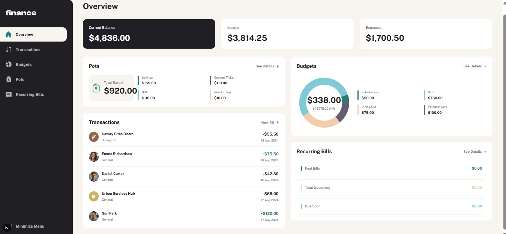

# Frontend Mentor - Personal finance app solution

This is a solution to the [Personal finance app challenge on Frontend Mentor](https://www.frontendmentor.io/challenges/personal-finance-app-JfjtZgyMt1). Frontend Mentor challenges help you improve your coding skills by building realistic projects. 

## Table of contents

- [Overview](#overview)
  - [The challenge](#the-challenge)
  - [Screenshot](#screenshot)
  - [Links](#links)
- [My process](#my-process)
  - [Built with](#built-with)
  - [What I learned](#what-i-learned)
  - [Continued development](#continued-development)
  - [Useful resources](#useful-resources)
- [Author](#author)
- [Acknowledgments](#acknowledgments)

**Note: Delete this note and update the table of contents based on what sections you keep.**

## Overview

### The challenge

Users should be able to:

- See all of the personal finance app data at-a-glance on the overview page
- View all transactions on the transactions page with pagination for every ten transactions
- Search, sort, and filter transactions
- Create, read, update, delete (CRUD) budgets and saving pots
- View the latest three transactions for each budget category created
- View progress towards each pot
- Add money to and withdraw money from pots
- View recurring bills and the status of each for the current month
- Search and sort recurring bills
- Receive validation messages if required form fields aren't completed
- Navigate the whole app and perform all actions using only their keyboard
- View the optimal layout for the interface depending on their device's screen size
- See hover and focus states for all interactive elements on the page
- **Bonus**: Save details to a database (build the project as a full-stack app)
- **Bonus**: Create an account and log in (add user authentication to the full-stack app)

### Screenshot

### Links

- Solution URL: [GitHub Repository](https://github.com/ebenezerejeh/personal-finance-app)
- Live Site URL: [Live Site](https://personal-finance-app-nkei.vercel.app/)

## My process

### Built with

- Semantic HTML5 markup
- Mobile-first workflow
- [TypeScript](https://www.typescriptlang.org/) - Typed JavaScript
- [React 19](https://reactjs.org/) - JS library
- [Next.js](https://nextjs.org/) - React framework (App Router)
- [Tailwind CSS v4](https://tailwindcss.com/) - Utility-first CSS
- [shadcn/ui](https://ui.shadcn.com/) - UI component library
- [Radix UI](https://www.radix-ui.com/) - Headless UI primitives
- [Redux Toolkit + RTK Query](https://redux-toolkit.js.org/) - Server state management
- [Zustand](https://zustand-demo.pmnd.rs/) - UI state management
- [React Hook Form](https://react-hook-form.com/) - Form handling
- [Zod](https://zod.dev/) - Schema validation
- [TanStack Table v8](https://tanstack.com/table/v8) - Headless table logic
- [Recharts](https://recharts.org/) - Chart library
- [Framer Motion](https://www.framer.com/motion/) - Animations
- [Axios](https://axios-http.com/) - HTTP client

### What I learned

**1. RTK Query for server state management**
Declarative data fetching with automatic caching and cache invalidation using `providesTags` and `invalidatesTags`. This eliminated the need for manual loading/error state management across the app.

**2. React Hook Form + Zod schema-first validation**
Defining the Zod schema first and inferring TypeScript types from it keeps form types and validation logic in sync with zero duplication. Inline error messages are handled automatically via `FormMessage`.

**3. Headless table logic with TanStack Table v8**
Separating table behaviour (sorting, filtering, pagination) from rendering gives full control over markup and styles while keeping complex logic out of components.

**4. Container/Presenter component pattern**
Splitting smart components (data fetching, logic) from dumb components (pure rendering) made each feature easier to test and reuse across the app.

**5. Behavior/style separation with Radix UI + Tailwind CSS**
Radix handles accessibility, keyboard navigation, and ARIA — Tailwind handles all visuals. This keeps concerns clean and avoids fighting browser-native semantics.

**6. Next.js App Router with Route Handlers**
Co-locating API logic with the frontend in a single repo using Route Handlers, defaulting to Server Components, and adding `"use client"` only where event handlers or browser APIs are needed.

### Continued development

- **Persist data to a real database** — integrate PostgreSQL with Prisma so mutations (adding pots, creating budgets) survive page reloads
- **Full user authentication** — extend the existing custom auth to support multiple user accounts, each with their own isolated data
- **End-to-end testing with Playwright** — cover critical flows such as adding a pot, creating a budget, and logging in
- **Data visualisation improvements** — add spending trends over time using line/bar charts on the overview and budgets pages

### Useful resources

- [RTK Query — Automated Refetching](https://redux-toolkit.js.org/rtk-query/usage/automated-refetching) - Essential reference for understanding `providesTags`/`invalidatesTags` and keeping the cache in sync after mutations.
- [TanStack Table v8 docs](https://tanstack.com/table/v8/docs/introduction) - The headless table guide that covers sorting, filtering, and pagination while keeping full control over rendering.
- [Zod + React Hook Form integration](https://react-hook-form.com/get-started#SchemaValidation) - Guide for wiring Zod schemas to forms with `@hookform/resolvers` for schema-first validation.
- [Radix UI primitives docs](https://www.radix-ui.com/primitives/docs/overview/introduction) - Reference for accessibility and keyboard behaviour that comes out of the box with Radix primitives.
- [Next.js App Router docs](https://nextjs.org/docs/app) - Covers Server Components, Route Handlers, and the `"use client"` boundary in the App Router.

## Author

- Frontend Mentor - [@ebenezerejeh](https://www.frontendmentor.io/profile/ebenezerejeh)
- Twitter - [@ebenezer_onuche](https://www.twitter.com/ebenezer_onuche)

## Acknowledgments

I thank God for giving me the strength and wisdom to complete this challenge, and I thank the Frontend Mentor community for providing such a great platform to practice and improve my frontend skills.

